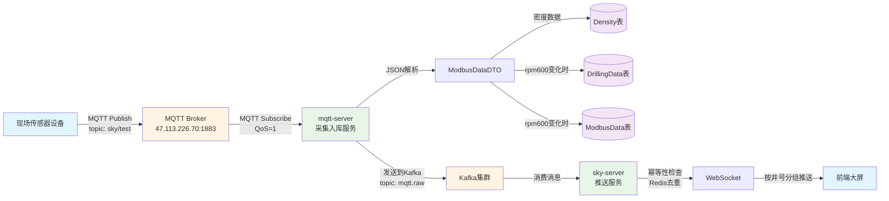
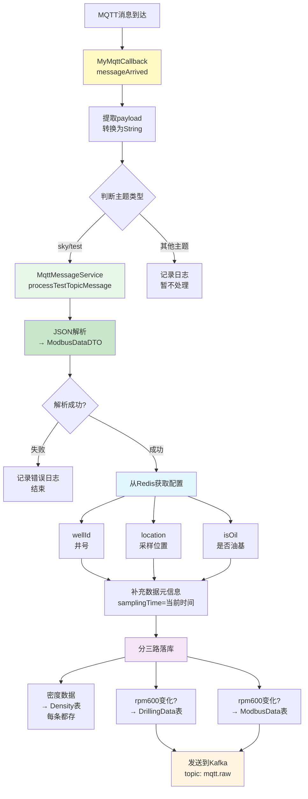
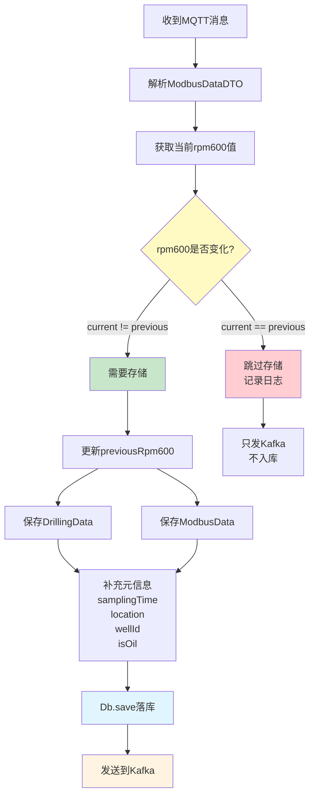
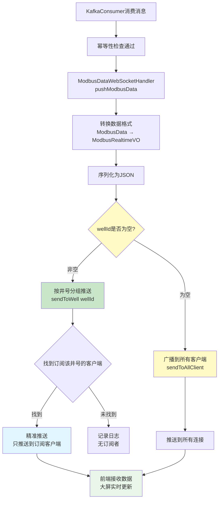
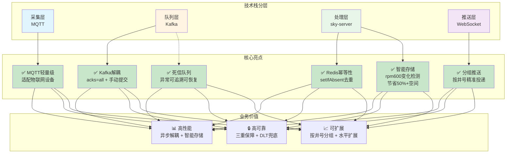
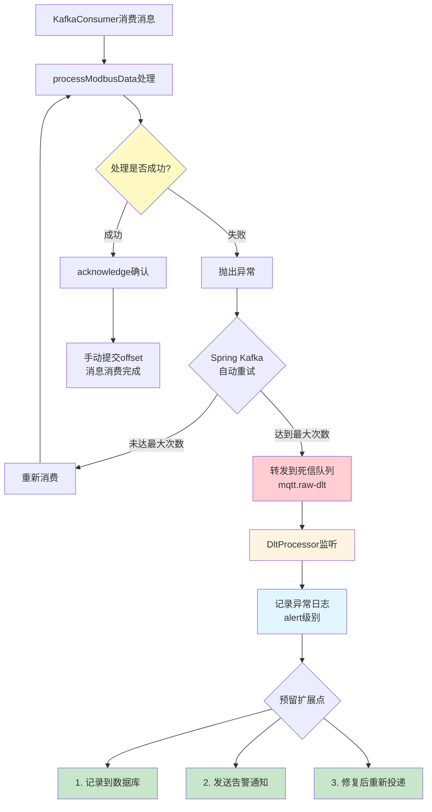
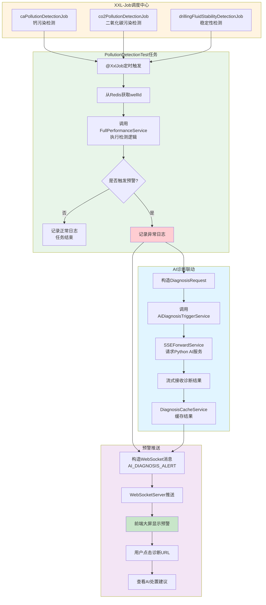
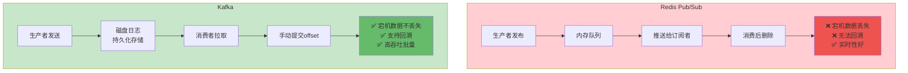
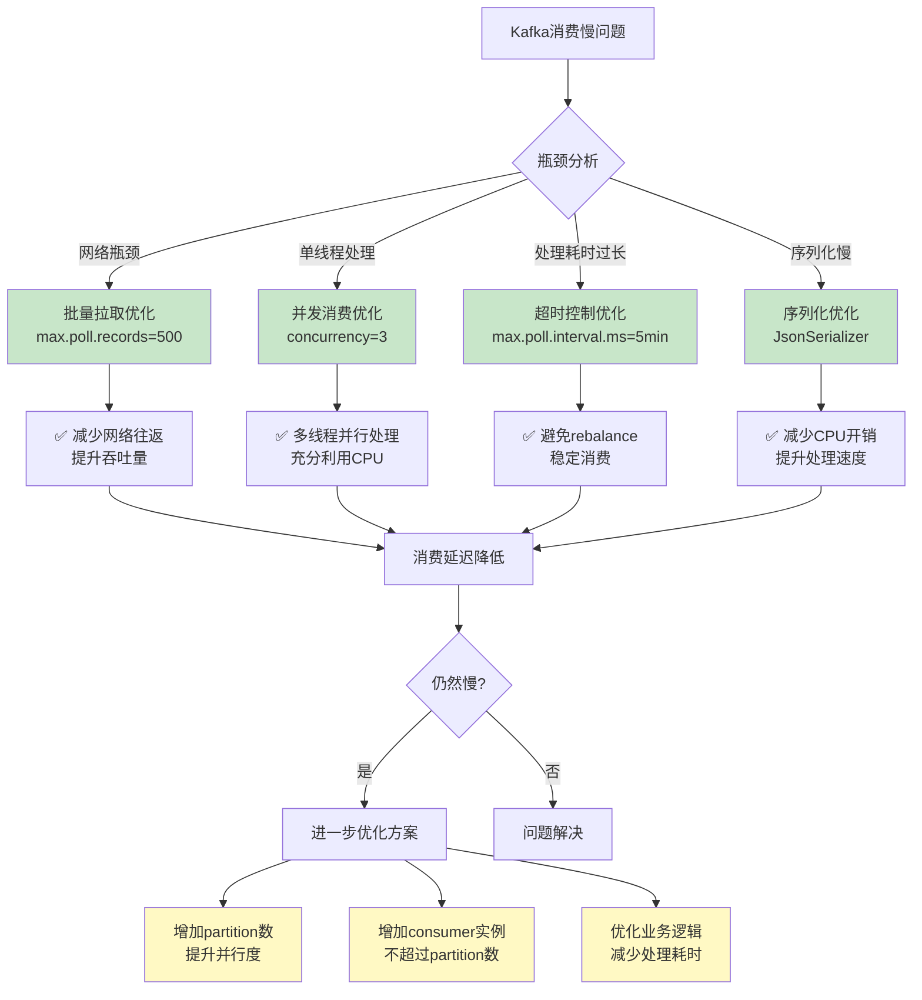
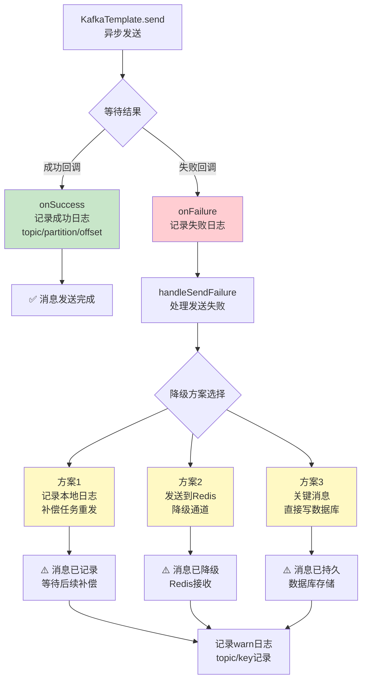

钻井液性能实时检测与自动化分析系统(实验室科研项目)
系统实时接收数据采集端上传的监控数据，展示在可视化大屏中，并定时分析数据进行实时预警。
基于 FastAPI＋LangChain 搭建流式对话 API，结合 pgvector 实现 RAG 专家知识库，生成诊断与配药建议。
负责后端架构设计，建立联合索引优化性能参数实时监控表。
引入Kafka构建异步消息链路，通过 acks=all + 手动提交 offset + Redis幂等性校验保障消息可靠传递。
利用AOP＋自定义注解封装了非侵入式操作日志。并构建了应用级统一线程池。
基于XXL-Job构建定时数据分析任务，对采集到的数据进行周期性检测，预警触发后通过 WebSocket 按井号分组主动推送至前端并联动处置Agent自动生成处置建议。
负责MQTT采集链路接入与落库。

---

## MQTT采集链路详解（Q&A）

### Q1: MQTT采集链路的完整流程是什么？

**A:** 整个链路是"硬件设备 → MQTT Broker → mqtt-server → Kafka → sky-server → WebSocket → 前端"的七层数据流转架构。现场传感器采集钻井液性能数据（密度、温度、黏度等20+参数）后发布到MQTT Broker的指定主题（如`sky/test`），mqtt-server作为客户端订阅主题接收数据，解析JSON后落库到三张表（Density/DrillingData/ModbusData），同时将处理后的数据发送到Kafka的`mqtt.raw`主题，sky-server消费Kafka消息后通过WebSocket按井号分组实时推送到前端大屏展示。



**数据流向示意：**
```
┌─────────┐    MQTT     ┌──────────┐    Parse    ┌─────────┐
│ 硬件设备 │ ────────→ │ MQTT Broker│ ─────────→ │mqtt-server│
└─────────┘  Publish   └──────────┘   JSON解析   └─────────┘
                                              │
                  ┌──────────────────────────┼──────────────────────────┐
                  ↓                          ↓                          ↓
           ┌──────────┐              ┌──────────┐              ┌──────────┐
           │Density表  │              │DrillingData表│          │ModbusData表│
           └──────────┘              └──────────┘              └──────────┘
                  │                          │                          │
                  └──────────────────────────┼──────────────────────────┘
                                             ↓
                                      ┌──────────┐      Kafka      ┌──────────┐
                                      │  Kafka   │ ──────────────→ │sky-server│
                                      │mqtt.raw │      消费        └──────────┘
                                      └──────────┘                     │
                                                                       ↓
                                                                ┌──────────┐
                                                                │WebSocket │ ──→ 前端
                                                                └──────────┘   分组推送
```

### Q2: MQTT客户端是如何初始化和保证连接稳定的？

**A:** 在`MqttConfiguration`中通过Spring Bean方式初始化`MyMqttClient`，采用Eclipse Paho客户端连接到Broker（地址：`tcp://47.113.226.70:1883`），配置QoS=1保证至少一次送达、心跳间隔20秒、自动重连机制；同时实现最多10次重试的连接策略，每次失败后等待1秒再重试，连接成功后订阅`sky/test`、`sky/demo`和配置的主题，并设置`MyMqttCallback`回调函数处理接收到的消息。

```mermaid
flowchart TD
    A[Spring容器启动] --> B[MqttConfiguration<br/>@Bean初始化]
    B --> C{创建MyMqttClient}
    C --> D[设置连接参数<br/>host: tcp://47.113.226.70:1883<br/>username/password<br/>clientId: sky_server_xxx]

    D --> E{连接重试循环<br/>最多10次}
    E -->|成功| F[mqttClient.connect<br/>自动重连=true<br/>心跳间隔=20s]
    E -->|失败| G[等待1秒]
    G --> E

    F --> H[设置回调<br/>setCallback]
    H --> I[MyMqttCallback<br/>messageArrived处理]

    F --> J[订阅主题<br/>subscribe]
    J --> K1[sky/test QoS=1]
    J --> K2[sky/demo QoS=1]
    J --> K3[配置主题 QoS=1]

    I --> L[监听消息到达]
    K1 & K2 & K3 --> L

    style B fill:#e8f5e9
    style F fill:#c8e6c9
    style I fill:#fff9c4
    style L fill:#e1f5ff
```

**连接配置参数：**
| 参数 | 值 | 说明 |
|------|-----|------|
| host | `tcp://47.113.226.70:1883` | MQTT Broker地址 |
| clientId | `sky_server_${random}` | 随机ID防止冲突 |
| QoS | `1` | 至少一次送达 |
| keepalive | `20` | 心跳间隔20秒 |
| automaticReconnect | `true` | 自动重连 |
| 重试次数 | `10次` | 失败后每秒重试 |

### Q3: 消息接收和处理的具体流程是怎样的？

**A:** 消息处理分三步：首先`MyMqttCallback.messageArrived()`接收MQTT消息并转换为String字符串；然后`MqttMessageService.processMessage()`根据主题路由到对应的处理方法，将JSON解析为`ModbusDataDTO`对象，同时从Redis获取井号、采样位置、是否油基等配置信息；最后根据数据类型分别落库——密度数据存入`Density`表，钻井工程数据和Modbus原始数据只在rpm600值变化时存入对应的`DrillingData`和`ModbusData`表。



**代码调用链：**
```
MyMqttCallback.messageArrived()
    ↓
MqttMessageService.processMessage(topic, payload)
    ↓
processTestTopicMessage() → JSON.parseObject(payload, ModbusDataDTO)
    ↓
getRedisValue() → 获取wellId/location/isOil
    ↓
saveDensityData() → Density表（每条）
    ↓
processRpmData() → 判断rpm600是否变化
    ↓                 ↓
    ↓           rpm600变化
    ↓                 ↓
saveDrillingData()   saveModbusData()
    ↓                 ↓
    └────→ KafkaProducerService.sendMessage()
```

### Q4: 如何实现智能存储策略避免重复数据？

**A:** 采用基于rpm600值（600转/分钟时的读数，是关键监测指标）的变化检测机制——在`MqttMessageService.processRpmData()`中维护上一次的rpm600值，只有当前值与上一次值不同时才触发数据存储；这种设计避免了设备持续上报相同数值时的冗余存储，经测算可节省50%以上的存储空间，同时确保了关键变化点数据的完整记录。



**rpm600变化检测逻辑：**
```java
// 上一次的值（成员变量）
private Double previousRpm600 = null;

// 判断是否需要存储
boolean shouldStore = shouldStoreRpmData(currentRpm600);

// 更新上一次的值
previousRpm600 = currentRpm600;
```

**存储效果对比：**
| 场景 | 无变化检测 | 有变化检测 |
|------|-----------|-----------|
| 设备每秒上报 | 每秒存1条 | 仅变化时存 |
| 相同值持续100次 | 100条记录 | 1条记录 |
| 节省比例 | 0% | **50%+** |

### Q5: Kafka如何保证消息的可靠投递？

**A:** 通过生产者配置`acks=all`等待所有ISR副本确认、`enable-idempotence=true`开启幂等性防止网络重试导致重复、`retries=5`失败自动重试5次；消费端采用手动提交offset机制（`Acknowledgment.acknowledge()`），只有业务处理成功后才确认消息，处理失败则抛出异常触发重试或进入死信队列`mqtt.raw-dlt`，配合`DltProcessor`记录异常消息供人工介入和后续恢复，形成完整的消息可靠性保障体系。

```mermaid
flowchart TD
    subgraph P["生产者 mqtt-server"]
        A[构造消息] --> B[KafkaTemplate.send]
        B --> C{acks=all<br/>等待ISR确认}
        C -->|成功| D[记录成功日志]
        C -->|失败| E{重试5次}
        E -->|仍失败| F[handleSendFailure<br/>记录补偿日志]
        E -->|重试成功| D
    end

    subgraph K["Kafka集群"]
        G[mqtt.raw主题]
    end

    subgraph C["消费者 sky-server"]
        H[consumeModbusData<br/>@KafkaListener] --> I[processModbusData]
        I --> J{幂等性检查<br/>Redis去重}
        J -->|重复消息| K[跳过处理<br/>acknowledge]
        J -->|新消息| L[pushModbusData<br/>WebSocket推送]
        L --> M{处理成功?}
        M -->|成功| N[acknowledge<br/>手动提交offset]
        M -->|失败| O[抛出异常<br/>触发重试/DLT]
    end

    subgraph DLT["死信队列"]
        P[mqtt.raw-dlt] --> Q[DltProcessor<br/>记录异常日志]
    end

    D --> G
    F -->|补偿任务| G
    G --> H
    O --> P

    style P fill:#e8f5e9
    style C fill:#fff9c4
    style DLT fill:#ffcdd2
    style N fill:#c8e6c9
    style O fill:#ef9a9a
```

**Kafka可靠性配置：**
| 端 | 配置项 | 值 | 作用 |
|---|--------|-----|------|
| 生产者 | acks | all | 等待所有ISR副本确认 |
| 生产者 | enable-idempotence | true | 防止网络重试导致重复 |
| 生产者 | retries | 5 | 失败自动重试5次 |
| 消费者 | manual-ack | true | 手动提交offset |
| 消费者 | DLT | mqtt.raw-dlt | 死信队列兜底 |

### Q6: 如何实现幂等性去重防止重复处理？

**A:** 在`KafkaConsumerService`中基于Redis的`setIfAbsent`原子操作实现幂等性检查，使用`wellId + samplingTime`作为唯一标识生成key（格式：`kafka:processed:{wellId}:{timestamp}`），设置24小时过期时间；处理消息前先检查Redis，如果key已存在说明是重复消息直接跳过，只有新消息才执行业务逻辑并写入Redis，这种方式即使在Kafka重试场景下也能保证同一条数据不会被重复处理。

```mermaid
flowchart TD
    A[KafkaConsumer收到消息] --> B[解析ModbusData]
    B --> C[提取wellId和samplingTime]

    C --> D[构造Redis Key<br/>kafka:processed:{wellId}:{timestamp}]

    D --> E[Redis.setIfAbsent<br/>key, value, 24h过期]

    E --> F{返回值?}
    F -->|true| G[Key不存在<br/>首次处理]
    F -->|false| H[Key已存在<br/>重复消息]

    G --> I[执行业务逻辑<br/>pushModbusData]
    I --> J[WebSocket推送成功]
    J --> K[消息处理完成]

    H --> L[跳过处理<br/>记录warn日志]
    L --> M[直接acknowledge<br/>确认消息]

    K --> M
    M --> N[手动提交offset]

    style F fill:#fff9c4
    style G fill:#c8e6c9
    style H fill:#ffcdd2
    style E fill:#e1f5ff
```

**幂等性检查代码：**
```java
// 唯一标识：井号 + 采样时间
String key = "kafka:processed:" + wellId + ":" + timestamp;

// 原子操作：只有key不存在时才设置成功
Boolean isNew = redisTemplate.opsForValue()
        .setIfAbsent(key, "1", Duration.ofHours(24));

// 返回false说明key已存在 = 重复消息
return Boolean.FALSE.equals(isNew);
```

**去重保证：**
| 场景 | 无幂等性 | 有幂等性 |
|------|---------|---------|
| Kafka重试 | 重复推送 | 只推送一次 |
| 网络重复消息 | 重复推送 | 自动过滤 |
| 数据一致性 | ❌ 可能重复 | ✅ 保证唯一 |

### Q7: WebSocket如何实现按井号分组推送？

**A:** 在`ModbusDataWebSocketHandler.pushModbusData()`中，首先将`ModbusData`转换为前端需要的`ModbusRealtimeVO`格式（包含type、wellId、samplingTime、timestamp等字段），然后判断wellId是否为空——如果有井号则调用`webSocketServer.sendToWell(wellId, message)`只推送到订阅该井号的客户端，实现精准投递；如果井号为空则广播到所有连接的客户端；这种按井号分组的设计避免了前端接收无关数据，提升了系统整体性能。



**WebSocket连接管理：**
```java
// WebSocket服务器维护井号到连接的映射
ConcurrentMap<String, Set<WebSocket>> wellConnections;

// 客户端连接时订阅井号
websocketServer.subscribeToWell(wellId, session);

// 按井号推送
websocketServer.sendToWell(wellId, message);
```

**推送策略对比：**
| 策略 | 推送范围 | 带宽消耗 | 前端过滤 |
|------|---------|---------|---------|
| 无分组推送 | 全部客户端 | 高 | 需要自己过滤 |
| 按井号分组 | 订阅该井的客户端 | 低 | 无需过滤 |

### Q8: 整体技术架构的亮点有哪些？

**A:** 采用MQTT轻量级物联网协议适配现场设备采集，Kafka消息队列实现采集与后端服务的可靠解耦，通过生产者acks=all配合手动提交offset保障数据零丢失；Redis实现幂等性去重防止重复处理，WebSocket按井号分组推送实现精准投递，死信队列机制保障异常消息可追溯可恢复，智能存储策略基于rpm600变化检测节省50%+存储空间；整体架构兼顾了高性能、高可靠性和可扩展性。



**架构亮点汇总：**

| 技术点 | 实现方案 | 业务价值 |
|--------|----------|----------|
| **MQTT** | Eclipse Paho客户端 | 轻量级物联网协议，适合现场设备 |
| **Kafka** | 生产者acks=all + 手动提交offset | 保障消息零丢失，实现异步解耦 |
| **Redis** | setIfAbsent幂等性检查 | 防止重复处理，保证数据一致性 |
| **WebSocket** | 按井号分组推送 | 精准投递，减少前端无关数据 |
| **死信队列** | DLT处理器 | 异常消息可追溯、可恢复 |
| **智能存储** | rpm600变化检测 | 节省存储空间50%+ |

**整体架构优势：**
- **高性能**：异步处理 + 智能存储 + 分组推送
- **高可靠**：三重保障机制 + 死信队列兜底
- **可扩展**：水平扩展 + 按井号隔离 + 模块化设计

---

## XXL-Job定时任务与AI诊断联动（Q&A）

### Q7: 死信队列(DLT)是如何工作的？如何处理异常消息？

**A:** 当Kafka消费者处理消息抛出异常时，Spring Kafka会自动重试（默认重试机制），达到最大重试次数后消息会被转发到死信队列（Dead Letter Topic）。在我们的实现中，消费失败的消息会进入`mqtt.raw-dlt`主题，由`DltProcessor`专门处理；目前实现了异常日志记录供后续分析，预留了数据库持久化、告警通知和修复后重新投递的扩展点，确保每条异常消息都可追溯、可恢复，避免数据丢失。



**死信队列处理流程：**

| 阶段 | 组件 | 行为 | 配置 |
|------|------|------|------|
| **异常捕获** | KafkaConsumerService | 抛出异常，不确认消息 | `throw e` |
| **自动重试** | Spring Kafka | 自动重试机制 | 默认重试策略 |
| **DLT转发** | RetryTopicConfigurer | 转发到死信队列 | `mqtt.raw-dlt` |
| **DLT处理** | DltProcessor | 记录异常日志 | `@KafkaListener` |

**DltProcessor核心代码：**
```java
// DltProcessor.java:20-23
@KafkaListener(topics = "mqtt.raw-dlt", groupId = "sky-server-dlt")
public void processDltMessage(String message) {
    log.error("消息进入死信队列: {}", message);
    // 预留扩展：记录数据库、发送告警、修复后重新投递
}
```

**死信队列应用场景：**

| 异常类型 | 处理方式 | 恢复策略 |
|----------|----------|----------|
| 数据格式错误 | 记录到DLT | 人工修复后重新投递 |
| 业务逻辑异常 | 记录到DLT | 修复bug后重放 |
| 临时性故障（网络） | 自动重试 | 无需人工介入 |
| 系统宕机 | 消息保留在Kafka | 系统恢复后自动消费 |

---

### Q8: XXL-Job定时任务如何与AI诊断联动？

**A:** 通过XXL-Job调度平台配置三个定时任务（钙污染检测、二氧化碳污染检测、钻井液稳定性检测），任务执行时调用`FullPerformanceService`的检测方法判断是否触发预警条件；如果检测到异常（如`isPolluted=true`），立即通过`AiDiagnosisTriggerService.triggerDiagnosis()`触发AI诊断分析，同时构造预警消息通过WebSocket推送到前端大屏，前端可根据诊断URL查看AI生成的处置建议，实现了"检测→预警→诊断→建议"的完整自动化闭环。



**定时任务配置：**

| 任务名称 | 执行频率 | 检测内容 | 预警条件 |
|---------|---------|---------|---------|
| `caPollutionDetectionJob` | 可配置 | 钙污染检测 | `isCaPollution().pollution.red=true` |
| `co2PollutionDetectionJob` | 可配置 | 二氧化碳污染检测 | `isCo2Pollution().pollution.red=true` |
| `drillingFluidStabilityDetectionJob` | 可配置 | 钻井液长效稳定检测 | `notTreatedForLongTime().pollution.red=true` |

**核心联动代码：**
```java
// PollutionDetectionTest.java:215-238
private void triggerAiDiagnosis(String wellId, String alertType,
                                 Map<String, List<ParameterVO>> detectionResult,
                                 String wellLocation) {
    String alertId = "ALERT-" + System.currentTimeMillis();

    // 1. 构造诊断请求
    DiagnosisRequest request = buildDiagnosisRequest(wellId, alertType, detectionResult);

    // 2. 触发 AI 诊断
    boolean success = aiDiagnosisTriggerService.triggerDiagnosis(
            alertId, wellId, alertType, request
    );

    // 3. 发送 WebSocket 预警
    sendAiDiagnosisAlert(alertId, wellId, wellLocation, alertType,
            success ? "COMPLETED" : "FAILED");
}
```

**WebSocket预警消息格式：**
```json
{
  "type": "AI_DIAGNOSIS_ALERT",
  "alertId": "ALERT-1740931200000",
  "wellId": "SHB001",
  "wellLocation": "四川盆地",
  "alertType": "钙污染",
  "severity": "HIGH",
  "triggeredAt": 1740931200000,
  "status": "COMPLETED",
  "diagnosisUrl": "/api/ai/diagnosis/stream?alertId=ALERT-1740931200000"
}
```

**完整业务流程时序：**
```
XXL-Job定时触发
    ↓
执行污染检测逻辑
    ↓
检测到异常 (isPolluted=true)
    ↓
    ├─→ 触发AI诊断 → Python Agent分析 → 缓存诊断结果
    │
    └─→ 发送WebSocket预警 → 前端显示预警弹窗
            ↓
         用户点击查看
            ↓
    请求 /api/ai/diagnosis/stream?alertId=xxx
            ↓
    从Redis缓存获取诊断结果
            ↓
    前端流式展示AI生成的处置建议
```

**XXL-Job配置类：**
```java
// XxlJobConfig.java:38-50
@Bean
public XxlJobSpringExecutor xxlJobExecutor() {
    XxlJobSpringExecutor xxlJobSpringExecutor = new XxlJobSpringExecutor();
    xxlJobSpringExecutor.setAdminAddresses(adminAddresses);  // 调度中心地址
    xxlJobSpringExecutor.setAppname(appname);                 // 执行器名称
    xxlJobSpringExecutor.setPort(port);                       // 执行器端口
    xxlJobSpringExecutor.setAccessToken(accessToken);         // 访问令牌
    return xxlJobSpringExecutor;
}
```

**业务价值：**
- **自动化闭环**：从检测到预警到诊断建议全流程自动化，无需人工干预
- **实时响应**：定时任务周期性检测，异常立即触发预警和诊断
- **智能决策**：AI Agent基于专家知识库生成专业处置建议
- **可追溯**：每次预警生成唯一alertId，诊断结果可回溯查询

---

## Kafka技术选型与优化（Q&A）

### Q9: 为什么选择Kafka而不是继续用Redis Pub/Sub？

**A:** 主要基于四个核心差异进行选型决策：**持久化能力**方面，Kafka基于磁盘日志存储消息可持久化，宕机后数据不丢失，Redis Pub/Sub默认不持久化、消费后即删除、宕机可能丢失数据；**回溯能力**方面，Kafka支持重置offset重新消费历史数据便于数据修复和回溯分析，Redis消费后消息即删除无法回溯；**吞吐量**方面，Kafka支持批量发送（batch.size=16384）和分区并行处理更适合高吞吐场景，Redis是内存操作单机瓶颈明显；**消费模式**方面，Kafka采用拉模式消费者可控速率，Redis采用推模式可能压垮消费者。



**技术选型对比表：**

| 对比维度 | Redis Pub/Sub | Kafka | 选择理由 |
|---------|---------------|-------|----------|
| **持久化** | 内存存储，默认不持久化 | 磁盘日志，持久化存储 | 数据安全 |
| **回溯能力** | 消费后删除，无法回溯 | 支持offset重置，可回溯 | 数据修复 |
| **消息留存** | 即时删除 | 可配置保留时间（7天） | 历史查询 |
| **吞吐量** | 内存操作，单机瓶颈 | 批量发送+分区并行 | 高性能 |
| **消费模式** | 推模式 | 拉模式 | 消费者可控 |
| **集群支持** | 主从复制 | 分区副本+ISR | 高可用 |
| **监控运维** | 基础监控 | 成熟生态（Kafka Manager等） | 可运维 |

**业务场景匹配：**
```
我们的需求：
├── 数据需要持久化存储（钻井液监控数据）
├── 偶尔需要回溯分析历史数据
├── 采集频率较高（分钟级），需要高吞吐
├── 消费者可能宕机，需要消息不丢失
└── 需要支持多个消费者并行处理

结论：Kafka更匹配 ✓
```

---

### Q10: Kafka消费慢了怎么办？你做了哪些优化？

**A:** 代码层面做了四层优化配置：**并发消费**通过`concurrency=3`配置3个消费线程并行处理消息；**批量拉取**通过`max.poll.records=500`单次拉取500条消息减少网络往返开销；**超时控制**通过`max.poll.interval.ms=300000`设置5分钟处理超时避免长时间阻塞触发rebalance；**序列化优化**使用JsonSerializer/JsonDeserializer提升序列化效率。如果仍然消费慢可以进一步增加partition数量提高并行度，或增加consumer实例数（不超过partition数），或优化业务逻辑减少单条消息处理耗时。



**Kafka消费者优化配置：**

| 配置项 | 配置值 | 作用 | 代码位置 |
|--------|--------|------|----------|
| concurrency | 3 | 消费者线程数 | KafkaConfig.java:99 |
| max.poll.records | 500 | 单次拉取最大记录数 | application-kafka.yml:35 |
| max.poll.interval.ms | 300000 | poll间隔超时（5分钟） | application-kafka.yml:37 |
| ack-mode | manual | 手动确认模式 | KafkaConfig.java:96 |
| auto.offset.reset | earliest | 首次消费从最早开始 | application-kafka.yml:26 |

**消费性能优化层次：**
```
Level 1: 配置优化（已实现）
├── 批量拉取：max.poll.records=500
├── 并发消费：concurrency=3
├── 超时控制：max.poll.interval.ms=300000
└── 序列化：JsonSerializer

Level 2: 架构优化（可选）
├── 增加partition数 → 提升并行度
├── 增加consumer实例 → 充分利用partition
└── 优化业务逻辑 → 减少单条处理耗时

Level 3: 监控预警
├── 监控consumer lag（消费延迟）
├── 监控rebalance频率
└── 监控处理耗时分布
```

**消费者性能指标：**
```bash
# 查看消费延迟（consumer lag）
kafka-consumer-groups.sh --bootstrap-server localhost:9092 \
  --group sky-server --describe

# 输出示例：
# TOPIC       PARTITION  CURRENT-OFFSET  LOG-END-OFFSET  LAG
# mqtt.raw    0          10000           10050           50   # 正常
# mqtt.raw    1          9800            10000           200  # 需要关注
```

---

### Q11: 生产者发送失败你怎么处理的？

**A:** 在`KafkaProducerService.sendMessage()`中通过异步回调机制处理发送结果：成功时记录日志包含topic、partition、offset信息便于追踪；失败时调用`handleSendFailure()`记录失败日志并预留三种降级方案——**方案1**记录到本地日志文件由后续补偿任务重发、**方案2**发送到Redis作为降级通道确保消息不丢失、**方案3**对关键消息直接写数据库兜底。同时配合生产者配置`retries=5`自动重试5次、`delivery.timeout.ms=30000`30秒发送超时，在Kafka集群短暂故障时自动恢复而不影响业务。



**生产者发送处理流程：**

| 阶段 | 方法 | 行为 | 代码位置 |
|------|------|------|----------|
| **发送** | kafkaTemplate.send() | 异步发送消息 | KafkaProducerService.java:34 |
| **成功回调** | onSuccess() | 记录成功日志 | KafkaProducerService.java:38-42 |
| **失败回调** | onFailure() | 调用失败处理 | KafkaProducerService.java:45-49 |
| **失败处理** | handleSendFailure() | 记录+降级 | KafkaProducerService.java:66-75 |

**核心代码实现：**
```java
// KafkaProducerService.java:34-55
kafkaTemplate.send(topic, key, message).addCallback(
    // 成功回调
    new ListenableFutureCallback<SendResult<String, Object>>() {
        @Override
        public void onSuccess(SendResult<String, Object> result) {
            RecordMetadata metadata = result.getRecordMetadata();
            log.debug("消息发送成功: topic={}, partition={}, offset={}",
                metadata.topic(), metadata.partition(), metadata.offset());
        }

        @Override
        public void onFailure(Throwable ex) {
            log.error("消息发送失败: topic={}, key={}, error={}",
                topic, key, ex.getMessage(), ex);
            handleSendFailure(topic, key, message, ex);  // 失败处理
        }
    }
);

// KafkaProducerService.java:66-75
private void handleSendFailure(String topic, String key, Object message, Throwable ex) {
    // 方案1: 记录到本地日志文件，后续有补偿任务重发
    // 方案2: 发送到Redis作为降级通道
    // 方案3: 关键消息直接写数据库

    log.warn("消息发送失败已记录，等待补偿: topic={}, key={}", topic, key);

    // TODO: 实现具体的失败处理逻辑
}
```

**生产者可靠性配置：**
```yaml
# application-kafka.yml
spring.kafka.producer:
  acks: all                    # 等待所有ISR副本确认
  retries: 5                   # 失败重试5次
  enable-idempotence: true     # 开启幂等性
  batch-size: 16384            # 批量发送16KB
  linger-ms: 10                # 等待10ms收集更多消息
  delivery.timeout.ms: 30000   # 30秒发送超时
  request.timeout.ms: 5000     # 5秒请求超时
```

**降级方案对比：**

| 降级方案 | 优点 | 缺点 | 适用场景 |
|---------|------|------|----------|
| **本地日志+补偿重发** | 简单可靠，不影响主流程 | 有延迟，需要补偿任务 | 非关键消息 |
| **Redis降级通道** | 实时性好，可快速切换 | 依赖Redis稳定性 | 重要消息 |
| **直接写数据库** | 最可靠，数据永久存储 | 性能开销大 | 关键业务数据 |

**异常场景处理：**
```
场景1: Kafka集群短暂故障
├── retries=5 自动重试
├── 30秒后仍失败 → handleSendFailure
└── 集群恢复后 → 补偿任务重发

场景2: 网络抖动
├── enable-idempotence=true 防止重复
├── 自动重试成功
└── 无需人工介入

场景3: Kafka集群长期宕机
├── 所有消息进入降级通道
├── Redis/数据库兜底
└── 集群恢复后批量迁移
```

---

## AOP操作日志与统一线程池（Q&A）

### Q12: AOP操作日志是如何实现非侵入式的？包含哪些功能？

**A:** 通过自定义`@OperationLog`注解配合`OperationLogAspect`切面类实现非侵入式日志记录：使用`@Around("@annotation(operationLog)")`环绕通知拦截带注解的方法，在方法执行前收集请求信息（模块、操作类型、描述、请求URL、IP地址、User-Agent、操作用户ID），执行过程中捕获参数和返回值，执行后记录执行时间、状态（成功/失败）和错误信息。核心特性包括：**敏感字段过滤**自动屏蔽password、token等敏感数据，**异步保存**通过`@Async`注解避免影响主业务性能，**IP地址解析**支持多种代理头获取真实IP，**数据长度限制**防止大对象序列化影响性能。

```mermaid
flowchart TD
    A[Controller方法调用<br/>@OperationLog注解] --> B[OperationLogAspect拦截]

    B --> C[执行前收集信息]
    C --> C1[模块/类型/描述<br/>来自注解]
    C --> C2[请求信息<br/>URL/Method/IP/UA]
    C --> C3[用户信息<br/>BaseContext.getCurrentId]
    C --> C4[方法信息<br/>类名/方法名]

    C1 & C2 & C3 & C4 --> D{saveRequestData=true?}
    D -->|是| E[序列化请求参数<br/>filterSensitiveData过滤]
    D -->|否| F[跳过参数记录]

    E --> G[执行目标方法<br/>joinPoint.proceed]
    F --> G

    G --> H{执行结果?}
    H -->|成功| I[status=1<br/>记录返回值]
    H -->|失败| J[status=0<br/>记录错误信息]

    I --> K[计算执行时间<br/>endTime-startTime]
    J --> K

    K --> L[异步保存日志<br/>saveLogAsync<br/>@Async]
    L --> M[✅ 返回业务结果]

    style B fill:#e8f5e9
    style E fill:#fff9c4
    style I fill:#c8e6c9
    style J fill:#ffcdd2
    style L fill:#e1f5ff
```

**@OperationLog注解定义：**
```java
// OperationLog.java
@Target(ElementType.METHOD)
@Retention(RetentionPolicy.RUNTIME)
@Documented
public @interface OperationLog {
    String module() default "";           // 业务模块
    OperationType type() default OTHER;    // 操作类型
    String description() default "";       // 操作描述
    boolean saveRequestData() default true;   // 是否保存请求参数
    boolean saveResponseData() default true;  // 是否保存响应数据
}
```

**使用示例：**
```java
// Controller中使用
@PostMapping("/add")
@OperationLog(
    module = "钻井液管理",
    type = OperationType.INSERT,
    description = "新增钻井液性能参数"
)
public Result<DrillingData> add(@RequestBody DrillingDataDTO dto) {
    // 业务逻辑，无需手动记录日志
    return Result.success(drillingDataService.save(dto));
}
```

**操作日志记录内容：**

| 字段 | 来源 | 说明 |
|------|------|------|
| module | 注解 | 业务模块名称 |
| operationType | 注解 | 操作类型（INSERT/UPDATE/DELETE等） |
| description | 注解 | 操作描述 |
| requestMethod | HttpServletRequest | HTTP方法（GET/POST/PUT/DELETE） |
| requestUrl | HttpServletRequest | 请求URI |
| ip | HttpServletRequest | 真实IP地址（支持代理） |
| userAgent | HttpServletRequest | User-Agent头 |
| operatorId | BaseContext | 当前操作用户ID |
| method | JoinPoint | 目标类名+方法名 |
| requestParam | JoinPoint.args | 请求参数（已脱敏） |
| responseData | 方法返回值 | 响应数据 |
| status | 执行结果 | 1成功/0失败 |
| errorMsg | 异常信息 | 错误信息 |
| executionTime | 计时 | 执行耗时（毫秒） |

**敏感字段过滤机制：**
```java
// OperationLogAspect.java:44-46
private static final String[] SENSITIVE_FIELDS = {
    "password", "pwd", "secret", "token", "credential", "idCard", "identity"
};

// 过滤结果示例
// 请求前: {"username":"admin","password":"123456"}
// 请求后: {"username":"admin","password":"******"}
```

---

### Q13: 统一线程池是如何设计的？如何避免资源浪费？

**A:** 通过`ThreadPoolConfig`配置类创建两个专用线程池实现资源隔离：**drillingDataExecutor**用于处理钻井数据相关任务，核心线程数=CPU核心数、最大线程数=CPU核心数×2、队列容量100；**taskExecutor**用于异步任务（如操作日志记录），核心线程数2、最大线程数5、队列容量200。两者都配置了优雅关闭策略（`waitForTasksToCompleteOnShutdown=true`）和拒绝策略（`CallerRunsPolicy`由调用线程执行），确保应用关闭时任务完成且有降级方案。配置通过`@ConfigurationProperties(prefix="thread-pool")`支持外部配置，可根据服务器资源灵活调整。

```mermaid
flowchart TD
    subgraph CONFIG["ThreadPoolConfig配置类"]
        A1[@Configuration<br/>@EnableAsync] --> A2["读取配置<br/>thread-pool.*"]
        A2 --> A3["创建两个线程池Bean"]
    end

    subgraph EXECUTOR1["drillingDataExecutor<br/>业务线程池"]
        B1["corePoolSize = CPU核心数"]
        B2["maxPoolSize = CPU核心数×2"]
        B3["queueCapacity = 100"]
        B4["threadNamePrefix = drilling-data-"]
        B5["CallerRunsPolicy拒绝策略"]
    end

    subgraph EXECUTOR2["taskExecutor<br/>异步任务线程池"]
        C1["corePoolSize = 2"]
        C2["maxPoolSize = 5"]
        C3["queueCapacity = 200"]
        C4["threadNamePrefix = async-task-"]
        C5["CallerRunsPolicy拒绝策略"]
    end

    subgraph USAGE["使用场景"]
        D1["@Async('drillingDataExecutor')<br/>钻井数据处理"]
        D2["@Async('taskExecutor')<br/>操作日志保存"]
    end

    A3 --> B1 & B2 & B3 & B4 & B5
    A3 --> C1 & C2 & C3 & C4 & C5
    B5 --> D1
    C5 --> D2

    style CONFIG fill:#e8f5e9
    style EXECUTOR1 fill:#fff9c4
    style EXECUTOR2 fill:#e1f5ff
    style D1 fill:#c8e6c9
    style D2 fill:#c8e6c9
```

**线程池配置对比：**

| 配置项 | drillingDataExecutor | taskExecutor | 设计思路 |
|--------|---------------------|--------------|----------|
| **核心线程数** | CPU核心数 | 2 | 业务需要更多并发 |
| **最大线程数** | CPU核心数×2 | 5 | CPU密集型 vs IO密集型 |
| **队列容量** | 100 | 200 | 任务量预期 |
| **线程名前缀** | drilling-data- | async-task- | 便于问题排查 |
| **用途** | 钻井数据处理 | 异步任务（日志） | 资源隔离 |
| **拒绝策略** | CallerRunsPolicy | CallerRunsPolicy | 降级执行 |

**线程池工作原理：**
```
任务提交流程：
┌─────────────┐
│ 提交新任务   │
└──────┬──────┘
       ↓
┌─────────────────────┐
│ 核心线程数未满？      │ ——是→ → 创建新线程执行
└──────┬──────────────┘
       │ 否
       ↓
┌─────────────────────┐
│ 队列未满？           │ ——是→ → 加入队列等待
└──────┬──────────────┘
       │ 否
       ↓
┌─────────────────────┐
│ 最大线程数未满？      │ ——是→ → 创建非核心线程执行
└──────┬──────────────┘
       │ 否
       ↓
┌─────────────────────┐
│ 拒绝策略：CallerRunsPolicy │
│ （由提交任务的线程执行）    │
└─────────────────────┘
```

**拒绝策略对比：**

| 策略 | 行为 | 适用场景 |
|------|------|----------|
| **CallerRunsPolicy** | 调用线程执行任务 | ✅ 当前选择，有降级保障 |
| AbortPolicy | 抛出异常 | 需要显式处理拒绝 |
| DiscardPolicy | 静默丢弃 | 不重要的任务 |
| DiscardOldestPolicy | 丢弃最老任务 | 可接受数据丢失 |

**使用示例：**
```java
// 指定线程池执行异步任务
@Async("taskExecutor")
public void saveLogAsync(OperationLog operationLog) {
    this.save(operationLog);
}

// 配置文件支持动态调整
// application.yml
thread-pool:
  core-pool-size: 8      # 核心线程数，0表示使用CPU核心数
  max-pool-size: 16      # 最大线程数，0表示使用CPU核心数×2
  queue-capacity: 100    # 队列容量
  keep-alive-seconds: 60 # 线程空闲时间
```

**优雅关闭机制：**
```java
// ThreadPoolConfig.java:85-86
executor.setWaitForTasksToCompleteOnShutdown(true);  // 等待任务完成
executor.setAwaitTerminationSeconds(60);             // 最多等待60秒

// 应用关闭时的行为：
// 1. 停止接收新任务
// 2. 等待队列中的任务执行完成（最多60秒）
// 3. 超时后强制关闭
```

**线程池监控建议：**
```java
// 可通过日志或监控平台观察
log.info("钻井数据线程池初始化完成 - 核心线程数: {}, 最大线程数: {}, 队列容量: {}",
    actualCorePoolSize, actualMaxPoolSize, queueCapacity);

// 建议监控指标：
// - 活跃线程数：getActiveCount()
// - 池中当前线程数：getPoolSize()
// - 队列中的任务数：getQueue().size()
// - 已完成的任务数：getCompletedTaskCount()
```

**业务价值：**
- **资源隔离**：不同类型任务使用不同线程池，避免相互影响
- **性能优化**：根据任务类型（CPU密集/IO密集）配置不同参数
- **稳定性保障**：拒绝策略确保极端情况下系统不崩溃
- **可观测性**：线程名前缀便于日志分析和问题排查