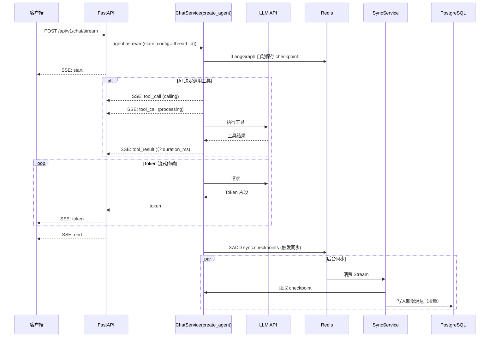

# 流式对话 API 详细设计文档

> **版本**: 3.1.0
> **更新日期**: 2026-02-12
> **项目**: yibccc-langchain

---

## 目录

1. [系统概述](#系统概述)
2. [架构设计](#架构设计)
3. [API 设计](#api-设计)
4. [数据模型](#数据模型)
5. [服务层设计](#服务层设计)
6. [数据流](#数据流)
7. [错误处理](#错误处理)
8. [安全考虑](#安全考虑)
9. [部署建议](#部署建议)

---

## 系统概述

### 功能描述

本系统是一个基于 FastAPI 的流式对话 API 服务，提供以下核心功能：

- **SSE 流式对话**: 使用 Server-Sent Events 实现实时流式响应
- **会话管理**: 支持多轮对话的会话持久化
- **工具调用**: 内置工具调用（Tool Calling）能力，支持时间查询等工具，并提供**工具调用流程展示**
- **数据持久化**: Redis 缓存 + PostgreSQL 归档的双层存储架构
- **API 认证**: 基于 API Key 的简单认证机制

### 技术栈

| 组件 | 技术 |
|------|------|
| Web 框架 | FastAPI 0.115+ |
| LLM 编排 | LangChain 1.0.0 (`create_agent`) |
| LLM 集成 | LangChain 1.0+ |
| LLM 提供商 | DeepSeek API |
| Checkpoint 存储 | LangGraph AsyncRedisSaver |
| 异步同步 | Redis Stream + 消费者组 |
| 数据库 | PostgreSQL (asyncpg 0.29+) |
| 异步运行时 | asyncio + uvloop |

---

## 架构设计

### 系统架构图

```
┌─────────────────────────────────────────────────────────────────────┐
│                           客户端层                                  │
│  ┌──────────────┐  ┌──────────────┐  ┌──────────────┐              │
│  │  Web 前端    │  │  移动端      │  │  第三方服务  │              │
│  └──────┬───────┘  └──────┬───────┘  └──────┬───────┘              │
│         │                  │                  │                      │
│         └──────────────────┴──────────────────┘                      │
│                            │ HTTP/SSE                               │
└────────────────────────────┼───────────────────────────────────────┘
                             │
┌────────────────────────────┼───────────────────────────────────────┐
│                      ┌───────┴────────┐                               │
│                      │  FastAPI     │                               │
│                      │    路由层     │                               │
│                      └───────┬────────┘                               │
│                              │                                        │
│         ┌────────────────────┼────────────────────┐                 │
│         │                    │                    │                 │
│  ┌──────▼──────┐    ┌───────▼─────────┐    ┌───▼──────────┐    │
│  │  认证中间件  │    │  ChatService     │    │  Sync       │    │
│  │  API Key    │    │  (create_agent)  │    │  Service    │    │
│  └─────────────┘    └───────┬───────────┘    └─────────────┘    │
│                              │                ^                    │
│         ┌────────────────────┼────────────────┼────────────┐      │
│         │                    │                │            │      │
│  ┌──────▼──────┐    ┌───────▼─────────┐    │  ┌─────────┴───┐  │
│  │  Redis     │    │   PostgreSQL    │    │  │ Redis       │  │
│  │ Checkpoint │◄───┤   (归档存储)     │    └──┤ Stream      │  │
│  │ (AsyncSaver│    │                 │       │ (异步同步)   │  │
│  │  + Storage)│    └─────────────────┘       └──────────────┘  │
│  └─────────────┘                                                     │
│                              │                                     │
│                        ┌─────▼──────────┐                          │
│                        │  DeepSeek API  │                          │
│                        └────────────────┘                          │
└─────────────────────────────────────────────────────────────────────┘
```

### 分层架构

| 层级 | 职责 | 模块 |
|------|------|------|
| **API 层** | 路由、认证、请求处理 | `src/api/main.py`, `src/api/routes/` |
| **服务层** | 业务逻辑、LangGraph 状态管理 | `src/services/chat_service.py`, `src/services/sync_service.py` |
| **仓储层** | 数据访问抽象 | `src/repositories/pg_repo.py` |
| **模型层** | 数据结构定义 | `src/models/schemas.py`, `src/models/exceptions.py` |

### LangChain & LangGraph 集成

- 使用 LangChain 1.0.0 `create_agent()` 构建对话 Agent
- `create_agent` 基于 LangGraph 构建，提供高级抽象
- `AsyncRedisSaver` 持久化 checkpoint 到 Redis
- `thread_id` 对应外部 `session_id`
- 支持工具调用（Tool Calling）和中间件（Middleware）
- **工具调用事件通过 SSE 实时推送给前端**

---

## API 设计

### 端点列表

| 方法 | 路径 | 描述 |
|------|------|------|
| GET | `/health` | 健康检查 |
| POST | `/api/v1/chat/stream` | 流式对话（SSE） |

**注意**:
- 本服务专注于 LLM 对话逻辑，Session 管理（创建、删除）应由后端服务处理
- LangGraph 的 `AsyncRedisSaver` 自动管理对话历史，无需额外的历史获取端点

### 认证机制

所有 API 端点（除 `/health`）都需要在 HTTP Header 中提供 API Key：

```http
X-API-Key: your-api-key
```

### 1. 流式对话 API

#### 请求

```http
POST /api/v1/chat/stream HTTP/1.1
Host: localhost:8000
X-API-Key: test-key
Content-Type: application/json

{
  "message": "你好，请介绍一下你自己",
  "session_id": "optional-uuid-for-existing-chat",
  "stream": true
}
```

#### 请求参数

| 字段 | 类型 | 必填 | 说明 |
|------|------|------|------|
| `message` | string | 是 | 用户消息内容 |
| `session_id` | string | 否 | 已有会话的 UUID，首次对话为空 |
| `stream` | boolean | 否 | 是否使用流式响应，默认 true |

#### SSE 响应格式

```http
HTTP/1.1 200 OK
Content-Type: text/event-stream
Cache-Control: no-cache

data: {"type":"start","session_id":"123e4567-e89b-12d3-a456-426614174000"}

data: {"type":"token","content":"你"}

data: {"type":"token","content":"好"}

data: {"type":"token","content":"！"}

data: {"type":"end","content":"stop"}
```

#### SSE 事件类型

| 类型 | 说明 | 数据结构 |
|------|------|----------|
| `start` | 对话开始 | `{"type": "start", "session_id": "uuid"}` |
| `token` | 文本片段 | `{"type": "token", "content": "文本"}` |
| `tool_call` | 工具调用事件 | `{"type": "tool_call", "tool_data": {"call_id": "uuid", "name": "...", "arguments": {...}, "status": "calling\|processing"}}` |
| `tool_result` | 工具结果事件 | `{"type": "tool_result", "tool_data": {"call_id": "uuid", "name": "...", "result": "...", "status": "result", "duration_ms": 123}}` |
| `end` | 对话结束 | `{"type": "end", "content": "stop/length"}` |
| `error` | 错误信息 | `{"type": "error", "error_code": "ERROR_CODE", "content": "错误描述"}` |

**工具调用状态说明**：
- `calling`: 工具正在被调用（🔄 图标）
- `processing`: 工具正在执行（⚙️ 图标）
- `result`: 工具执行完成（✅ 图标，附带结果和执行时长）

#### 工具调用 SSE 事件序列示例

```http
data: {"type":"tool_call","tool_data":{"call_id":"call-123","name":"get_current_time","arguments":{"timezone":"Asia/Shanghai"},"status":"calling"}}

data: {"type":"tool_call","tool_data":{"call_id":"call-123","name":"get_current_time","arguments":{"timezone":"Asia/Shanghai"},"status":"processing"}}

data: {"type":"tool_result","tool_data":{"call_id":"call-123","name":"get_current_time","result":"2026-02-12 10:30:00","status":"result","duration_ms":125}}
```

**对话历史管理**: LangGraph 使用 `AsyncRedisSaver` 自动保存和加载对话历史。当客户端使用相同的 `session_id` 发送消息时，LLM 会自动获得完整的对话上下文。

---

## 数据模型

### 核心数据结构

#### ToolCall（AIMessage.tool_calls 元素）

```python
class ToolCall(BaseModel):
    id: str           # 工具调用唯一标识（用于关联 ToolMessage）
    name: str         # 工具名称
    arguments: dict    # 工具参数
```

#### ToolCallData（SSE 工具事件数据）

```python
class ToolCallData(BaseModel):
    call_id: str                              # 工具调用唯一 ID（用于关联状态）
    name: str                                  # 工具名称
    arguments: dict                            # 工具参数（详细模式）
    status: Literal["calling", "processing", "result"]  # 调用状态
    result: Optional[str]                       # 工具执行结果
    error: Optional[str]                         # 错误信息
    duration_ms: Optional[int]                    # 执行时长（毫秒）
```

#### ChatMessage（对话消息）

```python
class ChatMessage(BaseModel):
    message_type: Literal["human", "ai", "system", "tool"]
    content: Optional[str]
    tool_calls: list[ToolCall]
    tool_call_id: Optional[str]
    tool_name: Optional[str]
    tool_status: Optional[Literal["pending", "success", "failed"]]
    tool_error: Optional[str]
    additional_kwargs: Optional[dict]
    timestamp: datetime
```

#### ChatRequest（对话请求）

```python
class ChatRequest(BaseModel):
    session_id: str | None   # 首次为空
    message: str             # 用户消息
    stream: bool = True      # 是否流式
```

#### ChatResponse（SSE 响应）

```python
class ChatResponse(BaseModel):
    type: Literal["start", "token", "tool_call", "tool_result", "end", "error"]
    session_id: str | None
    content: str | None
    tool_data: ToolCallData | None
    error_code: str | None
```

### 数据库表结构

详见 [SQL Schema](../sql/schema.sql)。

---

## 服务层设计

### ChatService（对话服务 - 基于 LangChain create_agent）

```python
class ChatService:
    def __init__(self, checkpointer: AsyncRedisSaver = None)
    async def initialize():
        """异步初始化：创建 checkpointer，构建 agent"""

    async def cleanup():
        """清理资源：关闭 checkpointer 连接"""

    def _build_agent():
        """使用 LangChain create_agent 构建对话 Agent"""

    async def chat_stream(
        request: ChatRequest,
        user_id: str
    ) -> AsyncIterator[ChatResponse]:
        """流式对话处理，支持工具调用事件"""

    async def _trigger_sync(session_id, user_id, message_count):
        """触发 Redis Stream 同步消息"""
```

#### 处理流程

1. **Agent 初始化**
   - 使用 `create_agent()` 构建对话 Agent
   - 注入 `AsyncRedisSaver` 作为 checkpointer
   - 调用 `await checkpointer.setup()` 创建 Redis 搜索索引
   - 配置工具列表（如 `get_current_time`）

2. **对话处理**
   - 使用 `agent.astream()` 流式处理
   - `stream_mode="messages"` 返回增量 token 片段
   - **检测 AIMessage 中的 tool_calls，发送 calling/processing 事件**
   - **检测 ToolMessage，发送 result 事件附带执行时长**
   - `thread_id` 映射为外部 `session_id`

3. **Checkpoint 持久化**
   - LangGraph 自动保存 checkpoint 到 Redis
   - 包含完整对话状态和消息历史

4. **异步同步触发**
   - 对话完成后发送消息到 Redis Stream
   - SyncService 消费并**增量同步**到 PostgreSQL

5. **资源管理**
   - `_owns_checkpointer` 标志跟踪资源所有权
   - `cleanup()` 方法关闭 Redis 连接

### SyncService（Redis Stream 消费者服务）

```python
class SyncService:
    # LangGraph 角色到 ChatMessage 角色的映射
    ROLE_MAP = {
        "human": "user",
        "ai": "assistant",
        "system": "system",
        "tool": "tool",
    }

    def __init__(self, pg_repo=None, graph=None):
        """初始化：接收 PostgreSQL 仓储和 CompiledGraph"""

    @staticmethod
    def _map_role(role: str) -> str:
        """映射 LangGraph 角色到 ChatMessage 角色"""

    async def start():
        """启动消费者：创建 Consumer Group 和 Worker"""

    async def stop():
        """停止消费者并关闭 Redis 连接"""

    async def _ensure_consumer_group(redis_client):
        """确保 Consumer Group 存在，处理各种错误情况"""

    async def _worker(redis_client, worker_id):
        """Worker 线程：从 Stream 读取并处理消息"""

    async def _process_sync_message(data):
        """处理同步消息：从 checkpoint 读取并写入 PostgreSQL"""

    async def _decode_data(data):
        """解码 Redis Stream bytes 数据"""
```

#### 关键实现细节

1. **角色映射**
   - LangGraph 使用 `human`/`ai`，ChatMessage 使用 `user`/`assistant`
   - `_map_role()` 静态方法处理映射

2. **Checkpoint 读取**
   - 使用 `graph.aget_state(config)` 获取状态
   - 从 `state_snapshot.values["messages"]` 提取消息

3. **消费者组创建**
   - 尝试 `mkstream=True` 创建
   - 处理 `BUSYGROUP` 错误（组已存在）
   - 失败时手动创建 Stream 后重试

---

## 数据流

### 对话流程时序图



### 数据存储策略

| 数据类型 | 存储位置 | 用途 |
|---------|---------|------|
| **Checkpoint** | Redis (AsyncRedisSaver) | LangGraph 状态、对话历史 |
| **同步消息** | Redis Stream | 异步同步触发 |
| **历史归档** | PostgreSQL | 长期存储、分析 |
| **用户数据** | PostgreSQL | 用户信息、配额 |

---

## 错误处理

### 错误代码规范

| 代码 | HTTP 状态 | 说明 |
|------|----------|------|
| `AUTH_FAILED` | 401 | API Key 无效 |
| `SESSION_NOT_FOUND` | 404 | 会话不存在 |
| `LLM_ERROR` | 500 | LLM 调用失败 |
| `TOOL_ERROR` | 500 | 工具执行失败 |
| `REDIS_CHECKPOINT_ERROR` | 500 | Redis Checkpoint 初始化失败（服务启动失败） |
| `APP_ERROR` | 500 | 应用内部错误 |

### 错误响应格式

#### SSE 流内错误

```http
data: {"type":"error","error_code":"LLM_ERROR","content":"DeepSeek API 超时"}
```

#### HTTP 错误响应

```json
{
  "detail": "Invalid API Key"
}
```

---

## 安全考虑

### 当前实现

1. **API Key 认证**
   - 简单字符串验证
   - 存储在环境变量中

2. **输入验证**
   - Pydantic 模型验证
   - 消息长度限制

3. **SQL 注入防护**
   - 使用 asyncpg 参数化查询

### 建议改进

1. **增强认证**
   - JWT Token
   - OAuth 2.0

2. **速率限制**
   - 基于 API Key 的请求限流
   - 使用 `slowapi` 或 `redis-rate-limit`

3. **内容过滤**
   - 敏感词检测
   - 输入/输出内容审核

4. **数据加密**
   - TLS/SSL 传输加密
   - 数据库字段加密（如需要）

---

## 部署建议

### 环境变量配置

```bash
# DeepSeek API
DEEPSEEK_API_KEY=sk-xxx
DEEPSEEK_BASE_URL=https://api.deepseek.com/v1
DEEPSEEK_MODEL=deepseek-chat

# Redis
REDIS_URL=redis://:password@host:6379
REDIS_DB=0
REDIS_MAX_CONNECTIONS=20

# PostgreSQL
PG_HOST=localhost
PG_PORT=5432
PG_DATABASE=yibccc_chat
PG_USER=postgres
PG_PASSWORD=postgres

# API Keys（逗号分隔）
API_KEYS=key1,key2,key3

# 应用配置
DEBUG=false
```

### Docker Compose 部署

```yaml
version: '3.8'

services:
  app:
    build: .
    ports:
      - "8000:8000"
    environment:
      - REDIS_URL=redis://:root@redis:6379
      - PG_HOST=postgres
      - PG_USER=postgres
      - PG_PASSWORD=postgres
    depends_on:
      - redis
      - postgres

  redis:
    image: redis:7-alpine
    command: redis-server --requirepass root

  postgres:
    image: postgres:15-alpine
    environment:
      - POSTGRES_USER=postgres
      - POSTGRES_PASSWORD=postgres
      - POSTGRES_DB=yibccc_chat
    volumes:
      - postgres_data:/var/lib/postgresql/data

volumes:
  postgres_data:
```

### 生产环境配置

```python
# uvicorn 生产配置
uvicorn.run(
    "src.api.main:app",
    host="0.0.0.0",
    port=8000,
    workers=4,              # 多 Worker 进程
    loop="uvloop",         # 使用 uvloop
    access_log=True,
    reload=False,           # 生产环境禁用自动重载
    limit_concurrency=100,  # 并发限制
    timeout_keep_alive=30,
)
```

---

## 扩展性考虑

### 工具调用

使用 LangChain 的 `@tool` 装饰器定义工具，然后在 `create_agent` 中传入：

```python
from langchain.tools import tool

@tool
def search_web(query: str) -> str:
    """搜索网络信息"""
    return f"搜索结果: {query}"

# 在 ChatService 中
self.tools = [get_current_time, search_web]

self.agent = create_agent(
    model=self.model,
    tools=self.tools,  # ← 传入工具列表
    checkpointer=self.checkpointer,
)
```

### 多 LLM 支持

```python
LLM_PROVIDERS = {
    "deepseek": ChatOpenAI(base_url="https://api.deepseek.com/v1"),
    "openai": ChatOpenAI(),
    "anthropic": ChatAnthropic(),
}

# 根据用户配置选择 LLM
llm = LLM_PROVIDERS[user.llm_provider]
```

### WebSocket 替代方案

对于需要双向通信的场景，可以考虑使用 WebSocket：

```python
from fastapi import WebSocket

@app.websocket("/ws/chat")
async def chat_websocket(websocket: WebSocket):
    await websocket.accept()
    while True:
        data = await websocket.receive_json()
        # 处理并流式返回
        await websocket.send_json(event)
```

---

## 监控建议

### 关键指标

| 指标 | 说明 | 告警阈值 |
|------|------|----------|
| 请求延迟 | p50/p95/p99 | p99 > 5s |
| 错误率 | 失败请求比例 | > 1% |
| LLM 超时率 | LLM 调用超时比例 | > 5% |
| 并发连接数 | 当前活跃连接 | > 1000 |
| Redis 命中率 | 缓存命中率 | < 80% |

### 日志记录

```python
import logging

logger = logging.getLogger(__name__)

# 关键操作日志
logger.info(f"New session created: {session_id} for user {user_id}")
logger.warning(f"LLM timeout: {session_id}")
logger.error(f"Database connection failed: {e}")
```

---

## 变更记录

| 版本 | 日期 | 变更内容 |
|------|------|----------|
| 3.1.0 | 2026-02-12 | 新增：工具调用流程展示功能；扩展 ToolCallData 模型支持三态（calling/processing/result）和执行时长统计；SSE 事件推送工具调用状态 |
| 3.0.0 | 2026-02-11 | 重构：使用 LangChain 1.0.0 `create_agent` 替代 StateGraph；添加工具支持（`get_current_time`）；修复流式输出增量处理；修复数据库重复存储（增量同步） |
| 2.2.0 | 2026-02-11 | 删除 `/api/v1/chat/history/{session_id}` 端点：LangGraph 自动管理对话历史，无需额外端点；添加 `Context` 和 `Runtime[Context]` 支持用户 ID 传递 |
| 2.1.0 | 2026-02-11 | 修复：添加 AsyncRedisSaver.setup() 调用创建 Redis 索引；添加角色映射支持 LangGraph 的 human/ai 类型；增强消费者组创建逻辑；添加资源清理机制 |
| 2.0.0 | 2026-02-11 | 重构为 LangGraph 架构：使用 AsyncRedisSaver 作为 checkpoint 存储，Redis Stream 实现异步同步到 PostgreSQL |
| 1.0.0 | 2026-02-11 | 初始版本，基于实际项目实现 |
