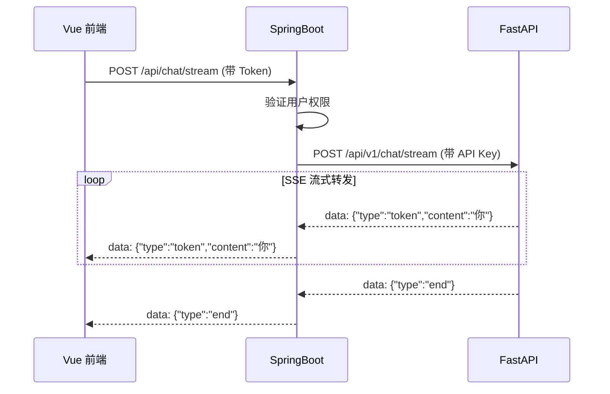

# SpringBoot WebFlux 对接指南

> **版本**: 1.0.0
> **更新日期**: 2026-02-25
> **目标服务**: yibccc-langchain (FastAPI)
> **架构模式**: SpringBoot 作为中间层转发 SSE 给 Vue 前端

---

## 目录

1. [架构概述](#架构概述)
2. [依赖配置](#依赖配置)
3. [WebFlux 配置](#webflux-配置)
4. [SSE 转发实现](#sse-转发实现)
5. [流式对话转发](#流式对话转发)
6. [诊断分析转发](#诊断分析转发)
7. [Vue 前端对接](#vue-前端对接)
8. [完整示例](#完整示例)

---

## 架构概述

### 系统架构

```
┌─────────────┐      HTTP/SSE       ┌─────────────┐      HTTP/SSE       ┌─────────────┐
│             │ ◄──────────────────► │             │ ◄──────────────────► │             │
│  Vue 前端   │                       │  SpringBoot │                       │  FastAPI    │
│  (前端)     │                       │  (中间层)   │                       │  (Agent)    │
│             │ ───────────────────► │             │ ───────────────────► │             │
└─────────────┘      HTTP/SSE       └─────────────┘      HTTP/SSE       └─────────────┘
```

### 职责划分

| 层级 | 职责 |
|------|------|
| **Vue 前端** | 用户界面、EventSource 接收 SSE |
| **SpringBoot** | 用户认证、权限控制、SSE 转发、业务逻辑 |
| **FastAPI** | LLM 对话、Agent 编排、工具调用 |

### 转发流程



---

## 依赖配置

### Maven (pom.xml)

```xml
<?xml version="1.0" encoding="UTF-8"?>
<project xmlns="http://maven.apache.org/POM/4.0.0"
         xmlns:xsi="http://www.w3.org/2001/XMLSchema-instance"
         xsi:schemaLocation="http://maven.apache.org/POM/4.0.0
         https://maven.apache.org/xsd/maven-4.0.0.xsd">
    <modelVersion>4.0.0</modelVersion>

    <parent>
        <groupId>org.springframework.boot</groupId>
        <artifactId>spring-boot-starter-parent</artifactId>
        <version>3.2.0</version>
        <relativePath/>
    </parent>

    <groupId>com.yibccc</groupId>
    <artifactId>backend-service</artifactId>
    <version>1.0.0</version>

    <properties>
        <java.version>17</java.version>
    </properties>

    <dependencies>
        <!-- Spring WebFlux (SSE 支持) -->
        <dependency>
            <groupId>org.springframework.boot</groupId>
            <artifactId>spring-boot-starter-webflux</artifactId>
        </dependency>

        <!-- Reactor Core -->
        <dependency>
            <groupId>io.projectreactor</groupId>
            <artifactId>reactor-core</artifactId>
        </dependency>

        <!-- Jackson (JSON 处理) -->
        <dependency>
            <groupId>com.fasterxml.jackson.core</groupId>
            <artifactId>jackson-databind</artifactId>
        </dependency>

        <!-- Lombok (可选，简化代码) -->
        <dependency>
            <groupId>org.projectlombok</groupId>
            <artifactId>lombok</artifactId>
            <optional>true</optional>
        </dependency>

        <!-- Spring Security (认证) -->
        <dependency>
            <groupId>org.springframework.boot</groupId>
            <artifactId>spring-boot-starter-security</artifactId>
        </dependency>

        <!-- JWT Token 解析 -->
        <dependency>
            <groupId>io.jsonwebtoken</groupId>
            <artifactId>jjwt-api</artifactId>
            <version>0.12.3</version>
        </dependency>
        <dependency>
            <groupId>io.jsonwebtoken</groupId>
            <artifactId>jjwt-impl</artifactId>
            <version>0.12.3</version>
            <scope>runtime</scope>
        </dependency>
        <dependency>
            <groupId>io.jsonwebtoken</groupId>
            <artifactId>jjwt-jackson</artifactId>
            <version>0.12.3</version>
            <scope>runtime</scope>
        </dependency>
    </dependencies>

    <build>
        <plugins>
            <plugin>
                <groupId>org.springframework.boot</groupId>
                <artifactId>spring-boot-maven-plugin</artifactId>
            </plugin>
        </plugins>
    </build>
</project>
```

---

## WebFlux 配置

### application.yml

```yaml
server:
  port: 8080

spring:
  application:
    name: yibccc-backend

# FastAPI Agent 服务配置
agent:
  base-url: http://localhost:8000
  api-key: ${AGENT_API_KEY:test-key}
  timeout:
    connect: 5000
    read: 60000    # 60秒，适合流式响应

# JWT 配置
jwt:
  secret: ${JWT_SECRET:your-secret-key}
  expiration: 86400000  # 24小时
```

### WebClient 配置类

```java
package com.yibccc.config;

import io.netty.channel.ChannelOption;
import io.netty.handler.timeout.ReadTimeoutHandler;
import io.netty.handler.timeout.WriteTimeoutHandler;
import org.springframework.beans.factory.annotation.Value;
import org.springframework.context.annotation.Bean;
import org.springframework.context.annotation.Configuration;
import org.springframework.http.HttpHeaders;
import org.springframework.http.MediaType;
import org.springframework.http.client.reactive.ReactorClientHttpConnector;
import org.springframework.web.reactive.function.client.WebClient;
import reactor.netty.http.client.HttpClient;

import java.time.Duration;
import java.util.concurrent.TimeUnit;

@Configuration
public class AgentWebClientConfig {

    @Value("${agent.base-url}")
    private String agentBaseUrl;

    @Value("${agent.api-key}")
    private String apiKey;

    @Value("${agent.timeout.read:60000}")
    private int readTimeout;

    @Bean
    public WebClient agentWebClient() {
        // 配置 HttpClient（长连接、大超时）
        HttpClient httpClient = HttpClient.create()
                .option(ChannelOption.CONNECT_TIMEOUT_MILLIS, 5000)
                .responseTimeout(Duration.ofMillis(readTimeout))
                .doOnConnected(conn -> conn
                        .addHandlerLast(new ReadTimeoutHandler(readTimeout, TimeUnit.MILLISECONDS))
                        .addHandlerLast(new WriteTimeoutHandler(30000, TimeUnit.MILLISECONDS))
                );

        return WebClient.builder()
                .baseUrl(agentBaseUrl)
                .clientConnector(new ReactorClientHttpConnector(httpClient))
                .defaultHeader(HttpHeaders.CONTENT_TYPE, MediaType.APPLICATION_JSON_VALUE)
                .defaultHeader("X-API-Key", apiKey)
                .build();
    }
}
```

### CORS 配置

```java
package com.yibccc.config;

import org.springframework.context.annotation.Bean;
import org.springframework.context.annotation.Configuration;
import org.springframework.web.cors.CorsConfiguration;
import org.springframework.web.cors.reactive.CorsWebFilter;
import org.springframework.web.cors.reactive.UrlBasedCorsConfigurationSource;

import java.util.List;

@Configuration
public class CorsConfig {

    @Bean
    public CorsWebFilter corsWebFilter() {
        CorsConfiguration config = new CorsConfiguration();

        // 允许的前端地址
        config.setAllowedOrigins(List.of("http://localhost:5173", "http://localhost:3000"));
        config.setAllowedMethods(List.of("GET", "POST", "PUT", "DELETE", "OPTIONS"));
        config.setAllowedHeaders(List.of("*"));
        config.setAllowCredentials(true);
        config.setMaxAge(3600L);

        UrlBasedCorsConfigurationSource source = new UrlBasedCorsConfigurationSource();
        source.registerCorsConfiguration("/**", config);

        return new CorsWebFilter(source);
    }
}
```

---

## SSE 转发实现

### 核心转发逻辑

```java
package com.yibccc.service;

import com.fasterxml.jackson.databind.ObjectMapper;
import lombok.RequiredArgsConstructor;
import lombok.extern.slf4j.Slf4j;
import org.springframework.stereotype.Service;
import org.springframework.web.reactive.function.client.WebClient;
import reactor.core.publisher.Flux;

import java.nio.charset.StandardCharsets;

@Slf4j
@Service
@RequiredArgsConstructor
public class SSEForwardService {

    private final WebClient agentWebClient;
    private final ObjectMapper objectMapper;

    /**
     * SSE 流式转发
     * 将 FastAPI 的 SSE 流直接转发给前端
     *
     * @param uri     Agent 服务 URI
     * @param request 请求体
     * @return SSE 事件流 (data: {json}\n\n 格式)
     */
    public Flux<String> forwardSSE(String uri, Object request) {
        return agentWebClient.post()
                .uri(uri)
                .bodyValue(request)
                .retrieve()
                .bodyToFlux(byte[].class)
                .map(bytes -> new String(bytes, StandardCharsets.UTF_8))
                .doOnNext(line -> log.debug("Forwarded SSE: {}", line))
                .doOnError(error -> log.error("SSE forward error: {}", error.getMessage()))
                .onErrorResume(error -> {
                    // 错误时返回错误事件
                    String errorEvent = String.format(
                            "data: {\"type\":\"error\",\"content\":\"%s\"}\n\n",
                            error.getMessage()
                    );
                    return Flux.just(errorEvent);
                });
    }
}
```

### 不解析，直接转发

**重要**: SSE 转发不需要解析 JSON，直接传递原始 `data: {json}` 行

```java
// ❌ 错误做法（解析再序列化，性能差）
.bodyToFlux(String.class)
.map(json -> parseEvent(json))
.map(event -> serializeEvent(event))

// ✅ 正确做法（直接转发）
.bodyToFlux(byte[].class)
.map(bytes -> new String(bytes, StandardCharsets.UTF_8))
```

---

## 流式对话转发

### Controller

```java
package com.yibccc.controller;

import com.yibccc.model.chat.ChatRequest;
import com.yibccc.service.SSEForwardService;
import lombok.RequiredArgsConstructor;
import org.springframework.http.MediaType;
import org.springframework.web.bind.annotation.*;
import reactor.core.publisher.Flux;

@RestController
@RequestMapping("/api/chat")
@RequiredArgsConstructor
public class ChatController {

    private final SSEForwardService sseForwardService;

    /**
     * 流式对话 - SSE 转发
     * Vue 前端通过 EventSource 接收
     */
    @PostMapping(value = "/stream", produces = MediaType.TEXT_EVENT_STREAM_VALUE)
    public Flux<String> chatStream(@RequestBody ChatRequest request) {
        log.info("Chat stream request: sessionId={}", request.getSessionId());

        // 直接转发到 FastAPI，返回 SSE 流
        return sseForwardService.forwardSSE("/api/v1/chat/stream", request);
    }
}
```

### 请求模型

```java
package com.yibccc.model.chat;

import com.fasterxml.jackson.annotation.JsonProperty;
import lombok.Data;

@Data
public class ChatRequest {
    private String message;

    @JsonProperty("session_id")
    private String sessionId;

    private Boolean stream = true;
}
```

---

## 诊断分析转发

### Controller

```java
package com.yibccc.controller;

import com.yibccc.model.diagnosis.DiagnosisRequest;
import com.yibccc.service.SSEForwardService;
import lombok.RequiredArgsConstructor;
import org.springframework.http.MediaType;
import org.springframework.web.bind.annotation.*;
import reactor.core.publisher.Flux;

@RestController
@RequestMapping("/api/diagnosis")
@RequiredArgsConstructor
public class DiagnosisController {

    private final SSEForwardService sseForwardService;

    /**
     * 诊断分析 - SSE 转发
     */
    @PostMapping(value = "/analyze", produces = MediaType.TEXT_EVENT_STREAM_VALUE)
    public Flux<String> analyze(@RequestBody DiagnosisRequest request) {
        log.info("Diagnosis request: wellId={}, alertType={}",
                request.getWellId(), request.getAlertType());

        return sseForwardService.forwardSSE("/api/v1/diagnosis/analyze", request);
    }

    /**
     * 查询诊断结果
     */
    @GetMapping("/{taskId}")
    public Flux<String> getResult(@PathVariable String taskId) {
        return sseForwardService.forwardSSE("/api/v1/diagnosis/{taskId}", null);
    }
}
```

### 诊断请求模型

```java
package com.yibccc.model.diagnosis;

import com.fasterxml.jackson.annotation.JsonProperty;
import lombok.Data;
import java.time.LocalDateTime;
import java.util.List;

@Data
public class DiagnosisRequest {
    @JsonProperty("well_id")
    private String wellId;

    @JsonProperty("alert_type")
    private String alertType;

    @JsonProperty("alert_triggered_at")
    private LocalDateTime alertTriggeredAt;

    @JsonProperty("alert_threshold")
    private AlertThreshold alertThreshold;

    private List<DrillingFluidSample> samples;

    private DiagnosisContext context;

    @JsonProperty("callback_url")
    private String callbackUrl;

    private Boolean stream = true;

    // ... 内部类定义
}
```

---

## Vue 前端对接

### EventSource 接收 SSE

```typescript
// src/api/chat.ts
export interface ChatMessage {
  message: string
  session_id?: string
  stream?: boolean
}

export interface ChatSSEEvent {
  type: 'start' | 'token' | 'tool_call' | 'tool_result' | 'end' | 'error'
  session_id?: string
  content?: string
  step?: 'data_analysis' | 'analyzing' | 'tool_call' | 'tool_result' | 'reasoning' | 'structuring'
  tool_data?: {
    call_id: string
    name: string
    arguments: Record<string, any>
    status: 'calling' | 'processing' | 'result'
    result?: string
    duration_ms?: number
  }
  error_code?: string
}

/**
 * 流式对话（SSE）
 */
export function streamChat(message: string, sessionId?: string) {
  const url = new URL('/api/chat/stream', import.meta.env.VITE_API_BASE_URL)

  return new EventSource(url, {
    // 使用 POST 请求（需要 fetch + reader 替代 EventSource）
    // 或者将参数编码到 URL
  })
}

/**
 * 使用 Fetch API + ReadableStream (推荐)
 */
export async function streamChatFetch(
  message: string,
  sessionId?: string,
  onEvent: (event: ChatSSEEvent) => void,
  onError?: (error: string) => void
) {
  const response = await fetch('/api/chat/stream', {
    method: 'POST',
    headers: {
      'Content-Type': 'application/json',
      'Authorization': `Bearer ${localStorage.getItem('token')}`,
    },
    body: JSON.stringify({
      message,
      session_id: sessionId,
      stream: true,
    }),
  })

  if (!response.ok) {
    throw new Error(`HTTP ${response.status}`)
  }

  const reader = response.body?.getReader()
  const decoder = new TextDecoder()

  while (true) {
    const { done, value } = await reader!.read()

    if (done) break

    const chunk = decoder.decode(value)
    const lines = chunk.split('\n')

    for (const line of lines) {
      if (line.startsWith('data: ')) {
        try {
          const event: ChatSSEEvent = JSON.parse(line.slice(6))
          onEvent(event)
        } catch (e) {
          console.error('Failed to parse SSE event:', line)
        }
      }
    }
  }
}
```

### Vue 组件示例

```vue
<!-- src/views/ChatView.vue -->
<script setup lang="ts">
import { ref } from 'vue'
import { streamChatFetch } from '@/api/chat'

const messages = ref<{ role: string; content: string }[]>([])
const currentContent = ref('')
const isLoading = ref(false)
const toolCalls = ref<any[]>([])

const sessionId = ref<string>()

async function sendMessage(userMessage: string) {
  isLoading.value = true
  currentContent.value = ''
  toolCalls.value = []

  await streamChatFetch(
    userMessage,
    sessionId.value,
    (event) => {
      switch (event.type) {
        case 'start':
          sessionId.value = event.session_id!
          break

        case 'token':
          currentContent.value += event.content || ''
          break

        case 'tool_call':
          toolCalls.value.push({
            ...event.tool_data,
            status: 'calling',
          })
          break

        case 'tool_result':
          const idx = toolCalls.value.findIndex(t => t.call_id === event.tool_data?.call_id)
          if (idx >= 0) {
            toolCalls.value[idx] = event.tool_data
          }
          break

        case 'end':
          messages.value.push({
            role: 'assistant',
            content: currentContent.value,
          })
          currentContent.value = ''
          isLoading.value = false
          break

        case 'error':
          console.error('Chat error:', event.error_code)
          isLoading.value = false
          break
      }
    },
    (error) => {
      console.error('Stream error:', error)
      isLoading.value = false
    }
  )
}
</script>

<template>
  <div class="chat-container">
    <!-- 消息列表 -->
    <div class="messages">
      <div v-for="(msg, i) in messages" :key="i" :class="msg.role">
        {{ msg.content }}
      </div>

      <!-- 当前生成内容 -->
      <div v-if="currentContent" class="assistant">
        {{ currentContent }}
      </div>
    </div>

    <!-- 工具调用展示 -->
    <div v-if="toolCalls.length" class="tool-calls">
      <div v-for="(tool, i) in toolCalls" :key="i" class="tool-call">
        <span v-if="tool.status === 'calling'">🔄</span>
        <span v-else-if="tool.status === 'processing'">⚙️</span>
        <span v-else>✅</span>
        {{ tool.name }}
      </div>
    </div>

    <!-- 输入框 -->
    <textarea
      v-model="userInput"
      @keydown.enter="sendMessage(userInput)"
      :disabled="isLoading"
      placeholder="输入消息..."
    />
  </div>
</template>
```

---

## 完整示例

### SpringBoot 主类

```java
package com.yibccc;

import org.springframework.boot.SpringApplication;
import org.springframework.boot.autoconfigure.SpringBootApplication;

@SpringBootApplication
public class YibcccBackendApplication {

    public static void main(String[] args) {
        SpringApplication.run(YibcccBackendApplication.class, args);
    }
}
```

### 认证过滤器（JWT）

```java
package com.yibccc.filter;

import io.jsonwebtoken.Claims;
import io.jsonwebtoken.Jwts;
import lombok.extern.slf4j.Slf4j;
import org.springframework.http.HttpStatus;
import org.springframework.stereotype.Component;
import org.springframework.web.server.ServerWebExchange;
import org.springframework.web.server.WebFilter;
import org.springframework.web.server.WebFilterChain;
import reactor.core.publisher.Mono;

@Slf4j
@Component
public class JwtAuthenticationFilter implements WebFilter {

    private static final String SECRET = "your-secret-key";
    private static final String[] EXCLUDE_PATHS = {
        "/api/auth/login",
        "/health",
        "/error"
    };

    @Override
    public Mono<Void> filter(ServerWebExchange exchange, WebFilterChain chain) {
        String path = exchange.getRequest().getPath().value();

        // 跳过登录等公开路径
        for (String exclude : EXCLUDE_PATHS) {
            if (path.contains(exclude)) {
                return chain.filter(exchange);
            }
        }

        // 验证 JWT
        String token = exchange.getRequest().getHeaders().getFirst("Authorization");
        if (token == null || !token.startsWith("Bearer ")) {
            exchange.getResponse().setStatusCode(HttpStatus.UNAUTHORIZED);
            return exchange.getResponse().setComplete();
        }

        try {
            Claims claims = Jwts.parserBuilder()
                    .setSigningKey(SECRET.getBytes())
                    .build()
                    .parseClaimsJws(token.substring(7))
                    .getBody();

            // 将用户信息存到请求属性
            exchange.getAttributes().put("userId", claims.getSubject());
            return chain.filter(exchange);

        } catch (Exception e) {
            exchange.getResponse().setStatusCode(HttpStatus.UNAUTHORIZED);
            return exchange.getResponse().setComplete();
        }
    }
}
```

---

## 附录

### A. SSE 格式说明

```text
SSE (Server-Sent Events) 标准格式:

1. 每行: data: {JSON字符串}\n
2. 事件结束: \n\n
3. 示例:
   data: {"type":"start","session_id":"uuid"}\n\n
   data: {"type":"token","content":"你"}\n\n
   data: {"type":"end","content":"stop"}\n\n
```

### B. 错误处理

```java
// Agent 服务不可用时返回友好错误
.onErrorResume(WebClientRequestException.class, e -> {
    String errorEvent = String.format(
        "data: {\"type\":\"error\",\"content\":\"Agent 服务暂时不可用，请稍后重试\"}\n\n"
    );
    return Flux.just(errorEvent);
})
```

### C. 性能优化

```yaml
# application.yml
spring:
  webflux:
    # 基础缓冲区大小（SSE 流）
    base-path: /api
```

```java
// 使用 Flux.buffer() 减少频繁的网络传输
.forwardSSE(uri, request)
.buffer(Duration.ofMillis(100))  // 100ms 批处理
.flatMap(Flux::just)  // 展平后发送
```

---

**文档版本**: v1.0.0
**最后更新**: 2026-02-25
**维护者**: Backend Team
